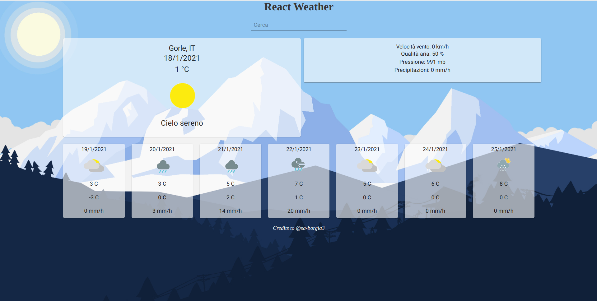
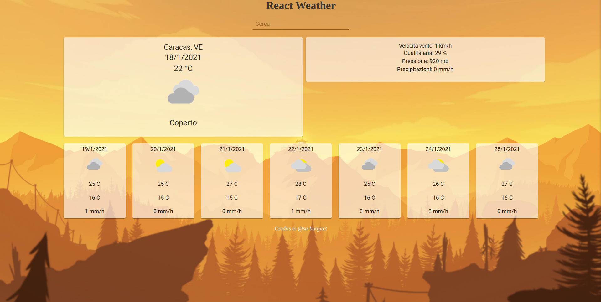

<strong>Weather Web-App<strong>
  
  Simple weather app made with React.
  
  Features:
  
  - Geolocations detects latitude and longitude in order to fetch data from the api on first page startup, and generally in every page update (in     componentDidMount);
  - Input search bar for searching city on Enter key press;
  - 7 days forecast;
  - background image changes when temperature > 20 or < 20.
  
  Install node_modules before starting npm start. 
  
  
  
